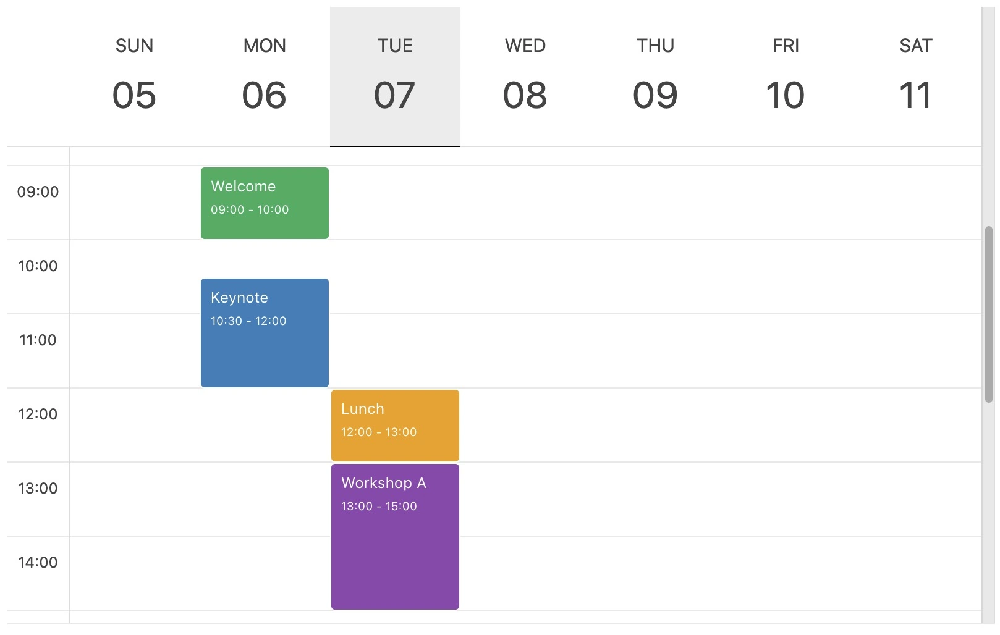

## Overview

This site demonstrates the Quarto TOASTUI Calendar shortcode extension. Here are some of the features:

- Embed TOAST UI Calendar in Quarto HTML output
- Data input via YAML metadata, inline shortcode arguments, or text files
- Configuration via YAML metadata or inline shortcode arguments
- Multiple calendar views (month, week, day)
- Customizable event and popup details
- 12/24hr formats
- Timezone support
- Responsive layout
- HTML format is supported



## Quick Start

1. Configure a calendar under toastui keyword in YAML metadata.
2. Call the shortcode where you want the calendar to appear with the calendar key.

```yaml
---
toastui:
  calendar-1:
    defaultView: week
    calendars:
      - id: cal1
        name: Personal
        backgroundColor: "#03bd9e"
    events:
      - id: "1"
        calendarId: cal1
        title: "Daily Sync"
        category: time
        start: "2026-04-09T09:00:00"
        end: "2026-04-09T09:30:00"
---

{}
```

See the [Usage page](usage.qmd) for usage examples and repo README.md for full list of options.
